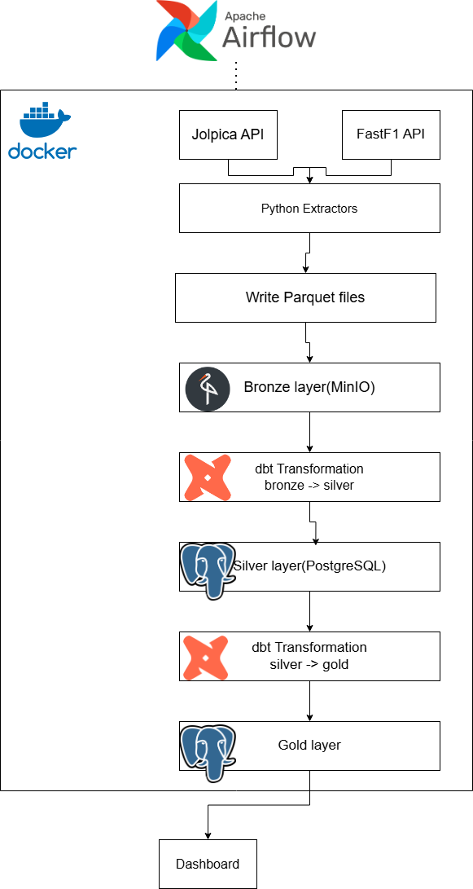

# End-to-End Formula 1 Data Engineering Pipeline

An end-to-end batch data pipeline that ingests Formula 1 telemetry and race data from the [Fastf1](https://theoehrly-fast-f1.mintlify.app/introduction) API, stores raw data in a Bronze layer on [MinIO](https://www.min.io/), transforms it into curated Silver and Gold layers in [PostgreSQL](https://www.postgresql.org/docs/)

## architecture

Project containerized through [Docker](https://www.docker.com/) and orchestrated through [Airflow](https://airflow.apache.org/)

pipeline workflow:
1. extract data from [Fastf1](https://theoehrly-fast-f1.mintlify.app/introduction) api to generate bronze layer data
2. Load bronze data to [MinIO](https://www.min.io/)
3. Validate incoming records using [Pydantic](https://pypi.org/project/pydantic/) models before loading them into the Silver layer.
4. generate star-schema analytical tables including race results, lap statistics, and telemetry metrics for dashboarding.

